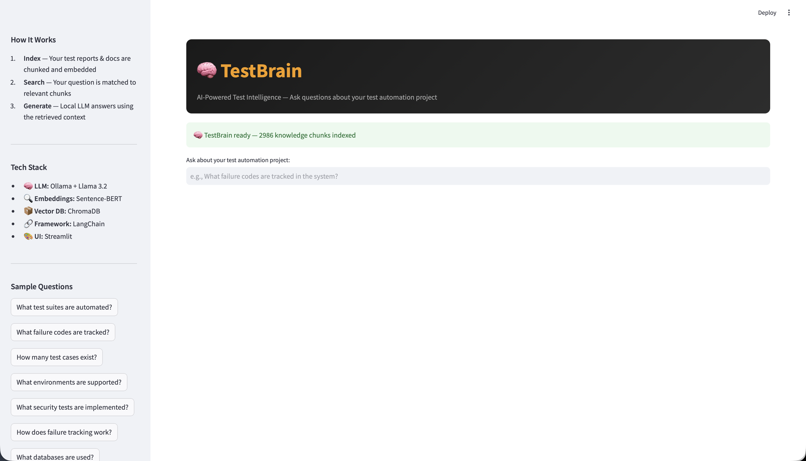

# 🧠 TestBrain

**AI-Powered Test Intelligence Assistant** — Ask natural language questions about your test automation project and get answers grounded in actual test data.

Built with RAG (Retrieval-Augmented Generation). Runs 100% locally. Zero API cost.



---

## What It Does

Instead of manually searching through test reports, logs, and documentation:

```
❌ Before: AWS CLI scan → copy output → paste to AI → wait → get answer
✅ After:  Type question in browser → instant answer with sources
```

**Example questions:**
- "What failure codes are tracked in the system?"
- "How many test cases are automated?"
- "What environments are supported?"
- "What security tests exist?"

---

## Architecture

```
┌─────────────────────────────────────────────────────────────┐
│                    TestBrain Architecture                     │
└─────────────────────────────────────────────────────────────┘

  YOUR TEST REPO              TESTBRAIN                    YOU
  (source data)               (RAG system)                 (user)
  ┌────────────┐         ┌──────────────────┐        ┌──────────┐
  │ .md docs   │         │                  │        │ Browser  │
  │ .json rpts │──index─►│  ChromaDB        │◄─ask──│ localhost │
  │ test data  │         │  (vector search) │        │ :8501    │
  └────────────┘         │        │         │        └──────────┘
                         │        ▼         │
                         │  Sentence-BERT   │
                         │  (embeddings)    │
                         │        │         │
                         │        ▼         │
                         │  Ollama/Llama    │──answer─►
                         │  (generation)    │
                         └──────────────────┘

  All components run LOCALLY on your machine.
  No data leaves your laptop. No API keys needed.
```

---

## Tech Stack

| Component | Technology | Purpose | Cost |
|-----------|-----------|---------|------|
| LLM | Ollama + Llama 3.2 (1B) | Generates natural language answers | Free |
| Embeddings | Sentence-BERT (all-MiniLM-L6-v2) | Converts text to searchable vectors | Free |
| Vector DB | ChromaDB | Stores and searches embeddings | Free |
| Framework | LangChain | Orchestrates the RAG pipeline | Free |
| UI | Streamlit | Web interface | Free |

**Total cost: $0** — everything runs locally.

---

## Quick Start

### Prerequisites
- Python 3.9+
- [Ollama](https://ollama.com/download))) installed

### Setup (one-time, ~3 minutes)

```bash
# 1. Clone this repo
git clone https://github.com/vpdinesh/TestBrain.git
cd TestBrain

# 2. Create virtual environment
python3 -m venv rag_env
source rag_env/bin/activate

# 3. Install dependencies
pip install -r requirements.txt

# 4. Start Ollama and pull model
brew services start ollama    # macOS
ollama pull llama3.2:1b       # Downloads 1.3GB model
```

### Run

```bash
# Step 1: Index your test documents
python3 indexer.py --path /path/to/your/test/repo

# Step 2: Launch TestBrain
streamlit run app.py
```

Open **http://localhost:8501** in your browser. Done!

---

## How to Connect Your Project

### Option 1: Point to your repo directory

```bash
python3 indexer.py --path /path/to/your/automation/repo
```

TestBrain will automatically find and index:
- All `.md` files (documentation, test plans, guides)
- All `.json` files in `reports/` or `test-reports/` directories
- Test data configuration files

### Option 2: Use environment variable

```bash
export TEST_REPO_PATH=/path/to/your/repo
python3 indexer.py
```

### Option 3: Customize file patterns

Edit `indexer.py` and modify `DEFAULT_PATTERNS`:

```python
DEFAULT_PATTERNS = [
    "**/*.md",                    # All markdown
    "**/reports/*.json",          # JSON reports
    "**/test-results/*.xml",      # JUnit XML (add parser)
    "**/docs/**/*.txt",           # Text docs
]
```

---

## Re-Indexing

After generating new test reports or adding documentation:

```bash
source rag_env/bin/activate
python3 indexer.py --path /path/to/your/repo
```

Takes 30-60 seconds. The Streamlit app automatically picks up the new data on next query.

---

## How RAG Works (for the curious)

### Phase 1: Indexing
```
Documents → Chunk (1000 chars) → Embed (384-dim vectors) → Store in ChromaDB
```

### Phase 2: Querying
```
Question → Embed → Find 5 most similar chunks → Build prompt → LLM answers
```

**Key concepts:**
- **Chunking:** Split large docs into small searchable pieces (like cutting a book into pages)
- **Embeddings:** Convert text to numbers that capture meaning (like a barcode for text)
- **Vector Search:** Find chunks with similar meaning to your question (not just keyword match)
- **Generation:** LLM reads the relevant chunks and writes a natural language answer

---

## Configuration

| Variable | Default | Description |
|----------|---------|-------------|
| `--path` | Current directory | Path to your test repo |
| `TEST_REPO_PATH` | (none) | Alternative to --path flag |
| `TESTBRAIN_MODEL` | `llama3.2:1b` | Ollama model to use |

### Using a different model

```bash
# Larger model (better quality, slower)
ollama pull llama3.2:3b
export TESTBRAIN_MODEL=llama3.2:3b
streamlit run app.py

# Or even larger
ollama pull llama3.1:8b
export TESTBRAIN_MODEL=llama3.1:8b
```

---

## Project Structure

```
TestBrain/
├── app.py              ← Streamlit web UI
├── indexer.py          ← Document indexer
├── requirements.txt    ← Python dependencies
├── .gitignore          ← Excludes env, db, cache
├── README.md           ← This file
├── screenshots/        ← UI screenshots
│   └── testbrain_ui.png
└── chroma_db/          ← Generated vector database (gitignored)
```

---

## Limitations & Roadmap

| Current Limitation | Future Enhancement |
|---|---|
| Small model (1B params) | Support for larger models (7B, 13B) |
| Static indexing | Auto re-index on file changes |
| No conversation memory | Multi-turn conversations |
| Text files only | PDF, DOCX, HTML parsing |
| Single user | Team deployment with shared index |

---

## Contributing

1. Fork the repo
2. Create a feature branch
3. Add your enhancement
4. Submit a pull request

---

## License

MIT License — free to use, modify, and distribute.

---

## Author

**Dinesh V P** — Senior Automation Engineer  
[LinkedIn](https://www.linkedin.com/in/dineshprahalathan/)

Built as part of exploring GenAI applications in Quality Engineering.
